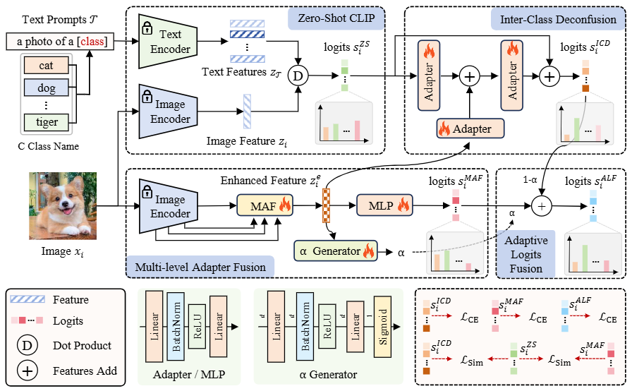
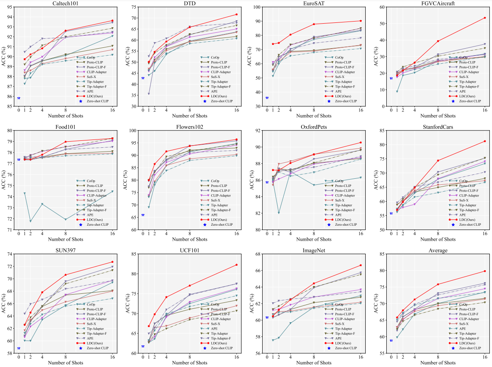

## Logits DeConfusion with CLIP for Few-Shot Learning

The code of "Logits DeConfusion with CLIP for Few-Shot Learning" (CVPR 2025), [paper from arxiv: https://arxiv.org/abs/2504.12104](https://arxiv.org/abs/2504.12104)


### Abstract

With its powerful visual-language alignment capability, CLIP performs well in zero-shot and few-shot learning tasks. However, we found in experiments that CLIP’s logits suffer from serious inter-class confusion problems in downstream tasks, and the ambiguity between categories seriously affects the accuracy. To address this challenge, we propose a novel method called Logits DeConfusion, which effectively learns and eliminates inter-class confusion in logits by combining our Multi-level Adapter Fusion (MAF) module with our Inter-Class Deconfusion (ICD) module. Our MAF extracts features from different levels and fuses them uniformly to enhance feature representation. Our ICD learnably eliminates inter-class confusion in logits with a residual structure. Experimental results show that our method can significantly improve the classification performance and alleviate the inter-class confusion problem. The code is available at https://github.com/LiShuo1001/LDC.


### Method




### Data

* Follow [./datasets/0_dataset.md](./datasets/0_dataset.md) to install ImageNet and other 10 datasets or [Tip-Adapter DATASET.md](https://github.com/gaopengcuhk/Tip-Adapter/blob/main/DATASET.md) and [FAR DATASET.md](https://github.com/WideStars/FAR/blob/main/doc/DATASET.md) .


### Pretraining Model

* Download Pretraining Model to `./model/clip`

```
_MODELS = {
    "RN50": "https://openaipublic.azureedge.net/clip/models/afeb0e10f9e5a86da6080e35cf09123aca3b358a0c3e3b6c78a7b63bc04b6762/RN50.pt",
    "RN101": "https://openaipublic.azureedge.net/clip/models/8fa8567bab74a42d41c5915025a8e4538c3bdbe8804a470a72f30b0d94fab599/RN101.pt",
    "RN50x4": "https://openaipublic.azureedge.net/clip/models/7e526bd135e493cef0776de27d5f42653e6b4c8bf9e0f653bb11773263205fdd/RN50x4.pt",
    "RN50x16": "https://openaipublic.azureedge.net/clip/models/52378b407f34354e150460fe41077663dd5b39c54cd0bfd2b27167a4a06ec9aa/RN50x16.pt",
    "ViT-B/32": "https://openaipublic.azureedge.net/clip/models/40d365715913c9da98579312b702a82c18be219cc2a73407c4526f58eba950af/ViT-B-32.pt",
    "ViT-B/16": "https://openaipublic.azureedge.net/clip/models/5806e77cd80f8b59890b7e101eabd078d9fb84e6937f9e85e4ecb61988df416f/ViT-B-16.pt",
}
```


## Config

* Config `DATA_ROOT` in `ldc_train.py`.

* Config `MODEL_CACHE_DIR` in `ldc_train.py`.

* Set `LOG_ROOT` in `ldc_train.py`.


## Train & Test

```
python ldc_train.py
```


## Result


#### ResNet50


```
imagenet [60.482, 61.254, 62.47200000000001, 64.44, 66.632]
fgvc [18.69186918691869, 21.54215421542154, 26.432643264326433, 39.363936393639364, 53.46534653465347]
caltech101 [89.73630831643003, 90.22312373225152, 90.8316430020284, 92.61663286004057, 93.63083164300204]
stanford_cars [56.970526053973394, 59.76868548687975, 64.81780873025743, 74.38129585872404, 81.20880487501555]
dtd [50.11820330969267, 54.66903073286053, 59.33806146572104, 65.83924349881796, 71.63120567375887]
eurosat [73.92592592592592, 74.64197530864197, 80.49382716049382, 87.8888888888889, 90.19753086419753]
oxford_flowers [79.98375964271214, 86.47990255785626, 91.55501421031262, 93.74746244417376, 96.38652050345108]
food101 [77.36963696369637, 77.36963696369637, 77.8052805280528, 78.97689768976898, 79.28052805280528]
oxford_pets [87.2172254020169, 87.18997001907877, 88.06214227309894, 89.09784682474789, 90.54238212046879]
sun397 [62.584382871536526, 64.54911838790932, 67.81863979848866, 70.63476070528966, 72.72040302267003]
ucf101 [66.82527094898228, 69.8123182659265, 74.12106793550093, 77.02881311128735, 82.26275442770287]
```

#### ViT-B/16

```
imagenet [69.538, 69.858, 71.042, 72.482, 73.88]
fgvc [27.57275727572757, 28.982898289828984, 31.95319531953195, 37.983798379837985, 47.88478847884788]
caltech101 [94.15821501014199, 94.56389452332658, 95.25354969574038, 95.86206896551724, 96.63286004056795]
stanford_cars [68.23778137047631, 70.74990672801891, 75.12747170749907, 79.69158064917299, 84.20594453426192]
dtd [58.333333333333336, 62.174940898345156, 66.43026004728132, 71.63120567375887, 77.24586288416076]
eurosat [78.49382716049382, 81.72839506172839, 86.37037037037038, 90.80246913580247, 92.1604938271605]
oxford_flowers [83.63784003248071, 89.24076329679252, 94.07226958993098, 95.98051157125457, 97.8481526593585]
food101 [85.88448844884489, 86.07260726072607, 86.7095709570957, 86.93729372937294, 87.36633663366337]
oxford_pets [91.25102207686018, 91.16925592804579, 91.82338511856092, 92.47751430907604, 93.34968656309621]
sun397 [67.98992443324937, 69.60705289672543, 73.09319899244332, 75.5617128463476, 76.91183879093198]
ucf101 [73.248744382765, 75.94501718213058, 79.75151995770553, 81.31112873380914, 84.77398889770024]
```


### Figure 5

```
python ldc_vis_figure5.py
```




## Acknowledgement

This repo benefits from [FAR](https://github.com/WideStars/FAR), [Tip](https://github.com/gaopengcuhk/Tip-Adapter), [CoOp](https://github.com/KaiyangZhou/CoOp), and [CLIP](https://github.com/openai/CLIP). Thanks for their works.


